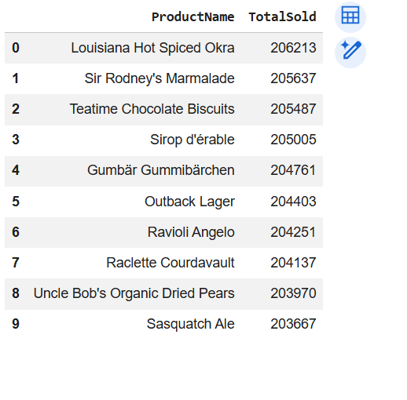
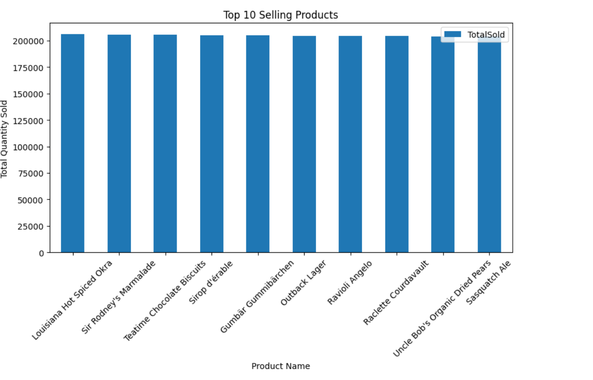
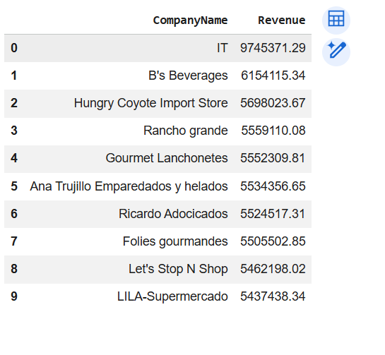
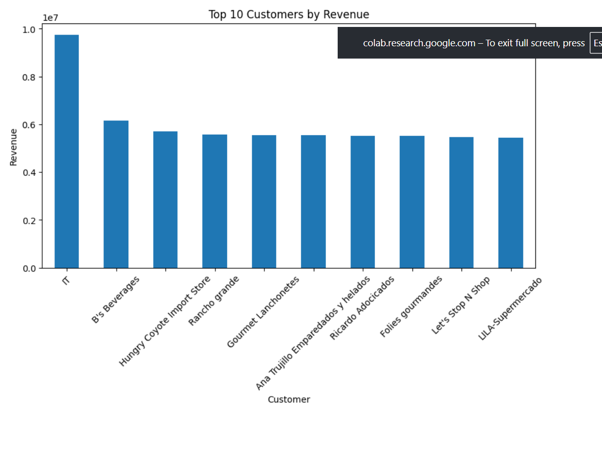
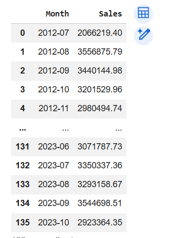
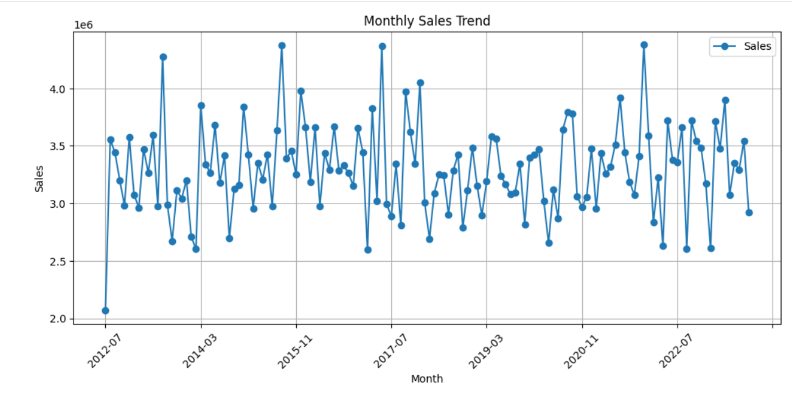
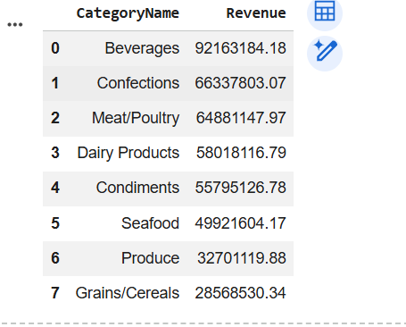
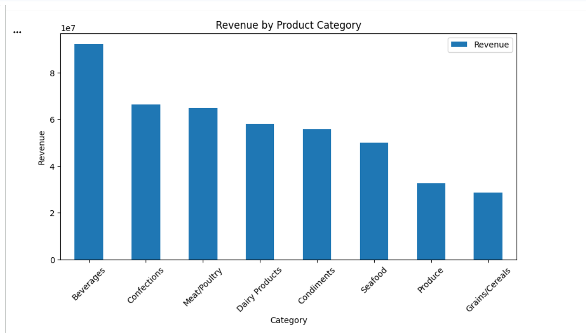
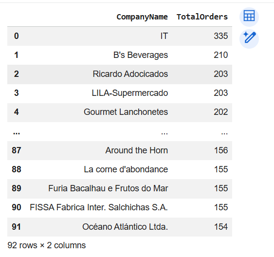
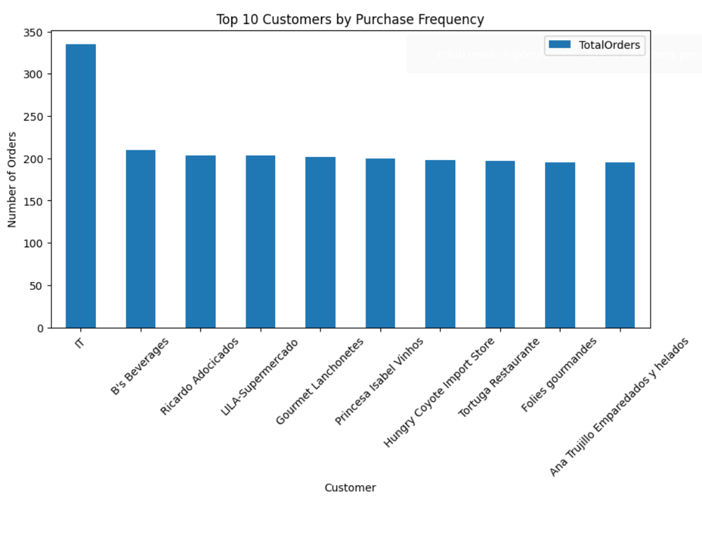

# Northwind SQL Analysis

## Project Overview

This project analyzes the Northwind SQLite database using SQL and Pandas in Google Colab. The objective is to answer business-related questions by writing SQL queries, visualizing the results, and deriving meaningful business insights.

## Dataset

- **Database:** Northwind SQLite Database
- **Source:** https://github.com/jpwhite3/northwind-SQLite3

## Tools & Technologies

- Google Colab
- SQLite
- SQL
- Python
- Pandas
- Matplotlib

## Business Questions

1. Find the Top 10 Selling Products.
2. Identify the Top 10 Customers by Revenue.
3. Analyze Monthly Sales Trends.
4. Discover the Best-Performing Product Categories.
5. Calculate Customer Purchase Frequency.

## Project Files

```
Northwind-SQL-Analysis/
│
├── analysis.ipynb
├── queries.sql
├── README.md
└── screenshots/
```

## SQL Analysis

The following SQL queries were executed:

- Top 10 Selling Products
- Top 10 Customers by Revenue
- Monthly Sales Trends
- Best Performing Product Categories
- Customer Purchase Frequency

## Data Analysis

The SQL query results were imported into Pandas for exploratory data analysis.

The following analyses were performed:

- Data inspection using `head()`
- Data summary using `describe()`
- Dataset information using `info()`
- Missing value analysis using `isnull().sum()`
- Data visualization using Matplotlib

## Business Insights

1. The top-selling products contribute significantly to the company's overall sales.

2. A small group of customers generates a large portion of the total revenue, indicating valuable high-revenue customers.

3. Monthly sales vary over time, showing periods of higher and lower business activity.

4. Certain product categories generate substantially higher revenue than others, making them the company's strongest-performing categories.

5. Customers with a higher purchase frequency represent loyal customers and contribute consistently to overall sales.


## Screenshots

### Top 10 Selling Products (Table)



### Top 10 Selling Products (Chart)



### Top 10 Customers by Revenue (Table)



### Top 10 Customers by Revenue (Chart)



### Monthly Sales Trends (Table)



### Monthly Sales Trends (Chart)



### Best Performing Categories (Table)



### Best Performing Categories (Chart)



### Customer Purchase Frequency (Table)



### Customer Purchase Frequency (Chart)



## Conclusion

This project demonstrates how SQL and Pandas can be used together to analyze business data, identify sales trends, evaluate customer behavior, and generate actionable business insights from the Northwind database.
