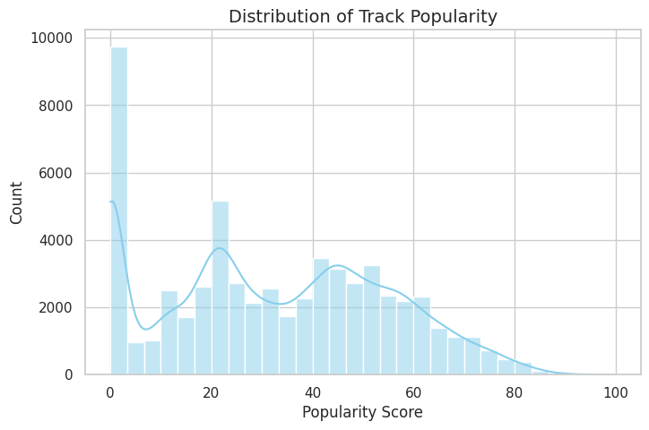
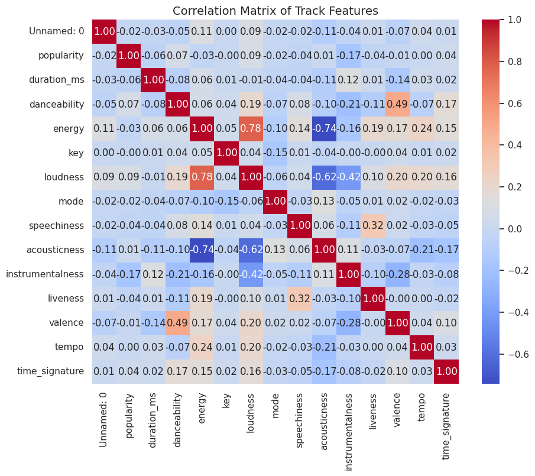
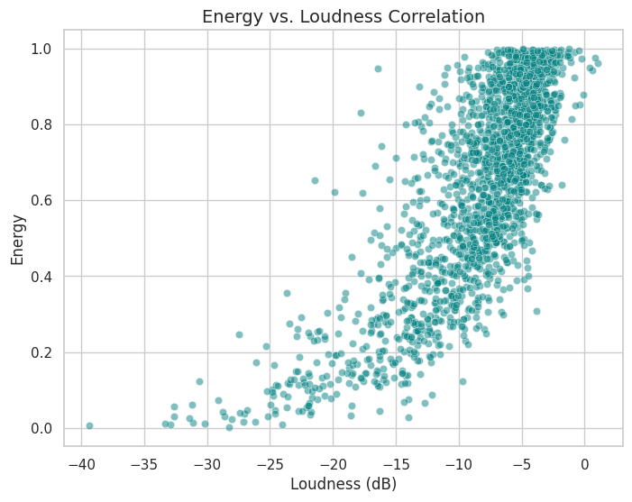
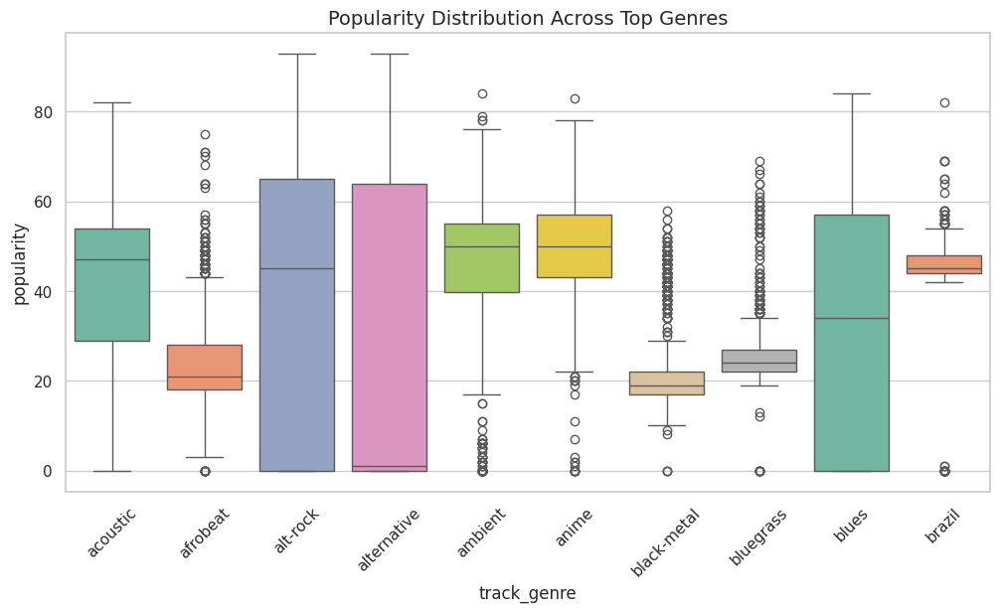
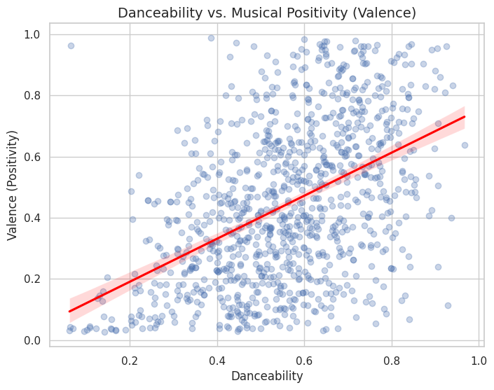
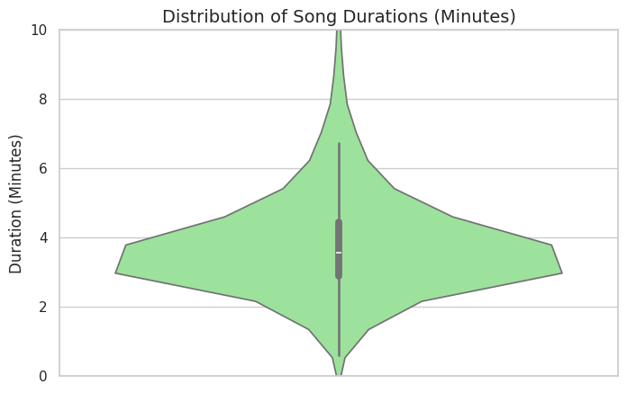

# Spotify Tracks EDA & Data Visualization

## Dataset Overview
The Spotify Tracks dataset contains musical features and popularity metrics across various genres.

## Visualizations & Key Insights

### 1. Popularity Distribution

* **Insight:** Popularity is right-skewed with a large cluster at score 0.

### 2. Audio Features Heatmap

* **Insight:** Strong positive correlation between loudness and energy; negative correlation between energy and acousticness.

### 3. Energy vs. Loudness

* **Insight:** Track energy increases predictably with higher loudness levels.

### 4. Genre vs. Popularity

* **Insight:** Mainstream genres show higher baseline popularity with fewer extreme outliers.

### 5. Danceability vs. Valence

* **Insight:** Tracks designed for dancing strongly align with happier acoustic moods.

### 6. Song Duration Distribution

* **Insight:** Streaming tracks strongly prefer a 3–4 minute duration window.

## Overall Conclusions
- Energy and loudness dominate modern track production standards.
- Commercial viability strongly favors track lengths between 3 and 4 minutes.
- Danceability and positivity (valence) exhibit high co-occurrence.
